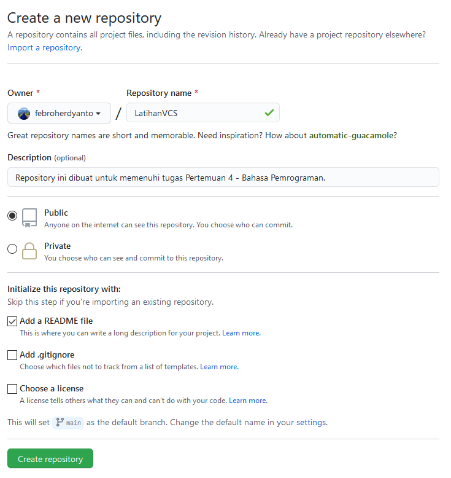
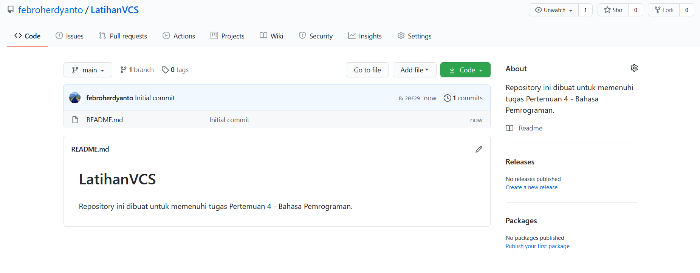

# LatihanVCS
Repository ini dibuat untuk memenuhi tugas Pertemuan 4 - Bahasa Pemrograman.

Nama    : Febro Herdyanto

NIM     : 312010043

Kelas   : TI.20.B.1

## Langkah-Langkah Penggunaan Git

* Download Git terlebih dahulu, dengan link berikut ini : [Click Here](https://git-scm.com/)

* Setelah file terdownload, silahkan lakukan instalasi dengan referensi berikut ini : [Git Installation Guide](https://git-scm.com/book/en/v2/Getting-Started-Installing-Git)

* Setelah installasi selesai, buka *software* **GitBash** pada menu di Windows, dan lakukan pengecekan versi, dengan mengetik syntax berikut :
    > git --version

* Buat akun di [GitHub](https://github.com) , seperti contoh dibawah ini. Dan lakukan *verifikasi* akun melalui email yang sudah terdaftar. 

* Jika akun GitHub sudah selesai dibuat dan diverifikasi, Proses selanjutnya silahkan buat *Repository* seperti gamabr dibawah ini.
**Penjelasan** : 
> * Repository Name : (Silahkan isi nama repository yang diinginkan, seperti contoh saya ingin membuat repository *LatihanVCS*)
> * Description : (Isi dengan deskripsi atau penjelasan tentang repository Anda)
> * Public / Private : (PIlih salah satu jenis repository akan bisa dilihan sama semua orang atau tidak)
> * Add a README.md file : Centang pada bagian ini jika Anda menginginkan file README.md ada di repository Anda
> * Add .gitignore : Merupakan  sebuah file yang berisi daftar nama-nama file dan direktori yang akan diabaikan oleh Git.
> * Choose a license : Silahkan centang jika Anda memiliki lisensi pada repository yang akan dibuat
Kemudian tekan tombol **Create Repository** untuk menyimpan

* Jika repository sudah dibuat maka akan muncul tampilan seperti dibawah ini :

