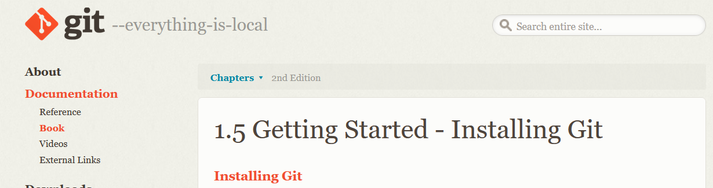
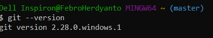

# LatihanVCS
Repository ini dibuat untuk memenuhi tugas Pertemuan 4 - Bahasa Pemrograman.

Nama    : Febro Herdyanto

NIM     : 312010043

Kelas   : TI.20.B.1

## Langkah-Langkah Penggunaan Git

* Download Git terlebih dahulu, dengan link berikut ini : [Click Here](https://git-scm.com/)

* Setelah file terdownload, silahkan lakukan instalasi dengan referensi berikut ini : [Git Installation Guide](https://git-scm.com/book/en/v2/Getting-Started-Installing-Git)

* Setelah installasi selesai, buka *software* **GitBash** pada menu di Windows, dan lakukan pengecekan versi, dengan mengetik syntax berikut :
    > git --version

* Buat akun di [GitHub](https://github.com) , seperti contoh dibawah ini. Dan lakukan *verifikasi* akun melalui email yang sudah terdaftar. 

Download -> Install -> Check Version -> Create GitHub Account -> Create Repository -> Klik Kanan File Explorer and GitBash Here -> Clone Repository in Local -> Edit README.md -> git-add -> git-commit -> git Push